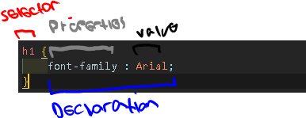

## Cascading Style Sheet (CSS)

Cascading Style Sheet adalah standar W3C untuk mendefinisikan penyajian (_presentation_) dokumen yang ditulis dalam HTML. Penyajian ini mengacu pada cara dokumen disampaikan kepada pengguna, apakah di layar komputer, ditampilkan di ponsel, dll.

### General CSS Syntax 


### External & Internal Link CSS

Untuk menerapkan rule style CSS bisa menggunakan melalui cara external link CSS dengan syntax berikut.
```
<link rel="stylesheet" href="">
```
Taruh external link tersebut di dalam tag body file HTML. Berikut ini contohnya:


Atau bisa juga dengan cara internal link dengan menggunakan elemen tag `<style>`. Berikut ini contohnya:


### Jenis-Jenis CSS Selector

| **Selector**              | **Arti**                                                                 | **Contoh**             | **Penjelasan**                                                                 |
|--------------------------|--------------------------------------------------------------------------|------------------------|---------------------------------------------------------------------------------|
| Universal Selector       | Menerapkan gaya ke semua elemen dalam dokumen                           | `* {}`                 | Menargetkan semua elemen dalam halaman                                         |
| Type Selector            | Menyesuaikan nama elemen                                                 | `h1, h2, h3 {}`        | Menargetkan elemen `<h1>`, `<h2>`, dan `<h3>`                                  |
| Class Selector           | Menargetkan elemen yang memiliki atribut `class` sesuai dengan nama yang diberikan setelah titik (`.`) | `.note {}`             | Menargetkan semua elemen yang memiliki `class="note"`                         |
|                          |                                                                          | `p.note {}`            | Menargetkan hanya elemen `<p>` dengan `class="note"`                          |
| ID Selector              | Menargetkan elemen yang memiliki atribut `id` sesuai dengan nama yang diberikan setelah tanda pagar (`#`) | `#introduction {}`     | Menargetkan elemen dengan `id="introduction"`                                 |
| Child Selector           | Menargetkan elemen yang merupakan _child selector_. Artinya cari elemen `<a>` yang merupakan _child_. dari elemen tag `<li>`     | `li > a {}`            | Menargetkan semua elemen `<a>` yang langsung berada dalam elemen `<li>`   |
| Descendant Selector      | Menargetkan elemen yang merupakan keturunan dari elemen lain (tidak harus anak langsung). Artinya dalam contoh tersebut adalah, semua elemen tag `<a>` adalah keturunan dari elemen tag `<p>` | `p a {}`               | Menargetkan semua elemen `<a>` yang berada di dalam elemen `<p>`              |
| Adjacent Sibling Selector| Menargetkan elemen yang merupakan saudara kandung terdekat setelah elemen lain | `h1 + p {}`            | Menargetkan elemen `<p>` pertama setelah `<h1>`                               |
| General Sibling Selector | Menargetkan elemen yang merupakan saudara kandung umum. | `h1 ~ p {}`            | Menargetkan semua elemen `<p>` yang merupakan saudara dari elemen `<h1>`      |

### Color 

#### Properties `color`

Properties `color` memungkinkan untuk mengatur warna teks (_foreground color_) dalam sebuah elemen. Hal ini dapat dilakukan dengan 3 cara:

- _RGB Values_
- _Hexadecimal Code_ 
- _Color Names_

!!! Example "_RGB Values_"
  ```
  /* Using RGB values */

  p {
    color: rgb(189, 189, 88);
  }
  ```

!!! Example "_Hexadecimal Code_"
```
  /* Using hexa value */

  h2 {
      color: #f5deb3;
  }
```

!!! Example "_Color Names_"
```
  /* Using color name */

  h1 {
    color: white;
  }
```

#### Properties `background-color`

Properties `background-color` memungkinkan untuk mengatur warna _background_ dalam sebuah elemen. 
Cara pengaturan warna nya sama seperti _properties_ `color`.

!!! Example "_RBG Value_"
```
body {
    background-color: rgb(200, 200, 200);
  }
```

!!! Example "_Hexadecimal Code_"
```
  h2 {
    background-color: #ee3e80;
  }
```

!!! Example "_Color Names_"
```
  p {
    background-color: white;
  }
```

!!! info "HTML and CSS Code"
=== "HTML"

    ``` html
    <!DOCTYPE html>
    <html lang="en">

    <head>
        <meta charset="UTF-8">
        <meta name="viewport" content="width=device-width, initial-scale=1.0">
        <title>Color in CSS</title>
    </head>

    <body>
        <link rel="stylesheet" href="color.css">
        <h1>Marine Biology</h1>
        <h2>Composition of Sea Water</h2>
        <p>
            Lorem ipsum dolor sit amet consectetur adipisicing elit. Nemo reiciendis molestiae iure repellat! Similique
            assumenda at eligendi pariatur magnam delectus corrupti, veritatis, eveniet quae ab, commodi dolore mollitia cum
            in!
        </p>
    </body>

    </html>
    ```
=== "CSS"

    ``` css
    /* How to add color to html element (selector) */


    /* FOREGROUWND COLOR */

    /* Using color name */

    h1 {
        color: white;
    }

    /* Using hexa value */

    h2 {
        color: #f5deb3;
    }

    /* Using RGB values */

    p {
        color: rgb(189, 189, 88);
    }


    /* BACKGROUND COLOR */

    body {
        background-color: rgb(200, 200, 200);
    }

    h1 {
        background-color: darkcyan;
    }

    h2 {
        background-color: #ee3e80;
    }

    p {
        background-color: white;
    }
    ```

### Text 

#### Properties `font-family`

Properties ini memungkinkan mengatur tampilan jenis huruf (_font_) dalam sebuah halaman website.

!!! info "HTML and CSS Code"
=== "HTML"

    ``` html
    <!DOCTYPE html>
    <html lang="en">

    <head>
        <meta charset="UTF-8">
        <meta name="viewport" content="width=device-width, initial-scale=1.0">
        <title>CSS Text</title>
    </head>

    <body>
        <link rel="stylesheet" href="text.css">
        <h1>Briads</h1>
        <p class="credit">by Ivy Duckets</p>
        <p class="intro">The <a class="breed" href="http://en.wikipedia.org/wiki/
        Briard">briard</a>, or berger de brei, is a large breed of dog traditionally used as
            a header and guardian of sheep
        </p>
    </body>

    </html>
    ```

=== "CSS"

    ``` css
    /* Specify font family / style / typeface */

    body {
        font-family: Georgia, 'Times New Roman', Times, serif;
    }

    h1,
    h2 {
        font-family: Arial, Verdana, Geneva, sans-serif;
    }

    .credit {

        font-family: 'Courier New', Courier, monospace;
    }
    ```

#### Properties `font-size`

Properti ini digunakan untuk mengatur ukuran tulisan (_font_) dalam sebuah halaman website. 
Berikut ini beberapa cara untuk mengatur ukuran tulisan:

  - Pixels
  - Percentages 
  - Ems 

!!! example "Pixels"
```
body {
    font-family: Georgia, 'Times New Roman', Times, serif;
    font-size: 12px;
}
```

!!! example "Percentage"
```
h1,
h2 {
    font-family: Arial, Verdana, Geneva, sans-serif;
    font-size: 200%;
}
```

!!! example "Ems"
```
.credit {

    font-family: 'Courier New', Courier, monospace;
    font-size: 1.5em;
}
```

!!! info "HTML and CSS Code"
=== "HTML"

    ``` html
    <!DOCTYPE html>
    <html lang="en">

    <head>
        <meta charset="UTF-8">
        <meta name="viewport" content="width=device-width, initial-scale=1.0">
        <title>CSS Text</title>
    </head>

    <body>
        <link rel="stylesheet" href="text.css">
        <h1>Briads</h1>
        <p class="credit">by Ivy Duckets</p>
        <p class="intro">The <a class="breed" href="http://en.wikipedia.org/wiki/
        Briard">briard</a>, or berger de brei, is a large breed of dog traditionally used as
            a header and guardian of sheep
        </p>
    </body>

    </html>
    ```

=== "CSS"

    ``` css
    /* Specify font family / style / typeface and font size*/

    body {
        font-family: Georgia, 'Times New Roman', Times, serif;
        font-size: 12px;
    }

    h1,
    h2 {
        font-family: Arial, Verdana, Geneva, sans-serif;
        font-size: 200%;
    }

    .credit {

        font-family: 'Courier New', Courier, monospace;
        font-size: 1.5em;
    }
    ```

#### Properties `font-weight`

Properties ini digunakan untuk membuat tulisan bold (_text bold_). Properties ini memiliki dua nilai (_value_), yaitu normal dan bold. Untuk value normal maka tampilan teks akan terlihat normal, sedangkan untuk value bold maka tampilan teks akan terlihat tebal.

!!! example "properties font-weight"

```
.credit {

    font-family: 'Courier New', Courier, monospace;
    font-size: 1.5em;
    font-weight: bold;
}
```

!!! info "HTML and CSS Code"
=== "HTML"

    ``` html
    <!DOCTYPE html>
    <html lang="en">

    <head>
        <meta charset="UTF-8">
        <meta name="viewport" content="width=device-width, initial-scale=1.0">
        <title>CSS Text</title>
    </head>

    <body>
        <link rel="stylesheet" href="text.css">
        <h1>Briads</h1>
        <p class="credit">by Ivy Duckets</p>
        <p class="intro">The <a class="breed" href="http://en.wikipedia.org/wiki/
        Briard">briard</a>, or berger de brei, is a large breed of dog traditionally used as
            a header and guardian of sheep
        </p>
    </body>

    </html>
    ```

=== "CSS"

    ``` css
    /* Specify font family / style / typeface and font size*/

    body {
        font-family: Georgia, 'Times New Roman', Times, serif;
        font-size: 12px;
    }

    h1,
    h2 {
        font-family: Arial, Verdana, Geneva, sans-serif;
        font-size: 200%;
    }

    .credit {

        font-family: 'Courier New', Courier, monospace;
        font-size: 1.5em;
        font-weight: bold;
    }
    ```

#### Properties `font-style`

Properties ini digunakan untuk membuat huruf / tulisan terlihat _italic_. Terdapat tiga value dalam properties ini, yaitu:

 - normal 
 - italic
 - oblique

!!! example "properties font-style"
```
.credit {

    font-style: italic;
}
```
!!! info "HTML and CSS Code"
=== "HTML"

    ``` html
    <!DOCTYPE html>
    <html lang="en">

    <head>
        <meta charset="UTF-8">
        <meta name="viewport" content="width=device-width, initial-scale=1.0">
        <title>CSS Text</title>
    </head>

    <body>
        <link rel="stylesheet" href="text.css">
        <h1>Briads</h1>
        <p class="credit">by Ivy Duckets</p>
        <p class="intro">The <a class="breed" href="http://en.wikipedia.org/wiki/
        Briard">briard</a>, or berger de brei, is a large breed of dog traditionally used as
            a header and guardian of sheep
        </p>
    </body>

    </html>
    ```

=== "CSS"

    ``` css
    /* Specify font family / style / typeface and font size*/

    body {
        font-family: Georgia, 'Times New Roman', Times, serif;
        font-size: 12px;
    }

    h1,
    h2 {
        font-family: Arial, Verdana, Geneva, sans-serif;
        font-size: 200%;
    }

    .credit {

        font-family: 'Courier New', Courier, monospace;
        font-size: 1.5em;
        font-weight: bold;
        font-style: italic;
    }
    ```

#### Properties `text-transform`

Properties ini digunakan untuk mengubah huruf besar/kecil pada sebuah teks / tulisan.

!!! example "text-transform: uppercase"
```
body {
    font-family: Georgia, 'Times New Roman', Times, serif;
    font-size: 12px;
    text-transform: uppercase;
}
```

!!! example "text-transform: lowercase"
```
h1,
h2 {
    font-family: Arial, Verdana, Geneva, sans-serif;
    font-size: 200%;
    text-transform: lowercase;
}

```

!!! example "text-transform: capitalize"
```
.credit {

    font-family: 'Courier New', Courier, monospace;
    font-size: 1.5em;
    text-transform: capitalize;
}
```

!!! info "HTML and CSS Code"
=== "HTML"

    ``` html
    <!DOCTYPE html>
    <html lang="en">

    <head>
        <meta charset="UTF-8">
        <meta name="viewport" content="width=device-width, initial-scale=1.0">
        <title>CSS Text</title>
    </head>

    <body>
        <link rel="stylesheet" href="text.css">
        <h1>Briads</h1>
        <p class="credit">by Ivy Duckets</p>
        <p class="intro">The <a class="breed" href="http://en.wikipedia.org/wiki/
        Briard">briard</a>, or berger de brei, is a large breed of dog traditionally used as
            a header and guardian of sheep
        </p>
        <h2>Breed History</h2>
        <p class="description">
            The briad, which is believed to have originated in France, has been bred for centuries to herd and protect the
            sheep.
        </p>
    </body>

    </html>
    ```

=== "CSS"

    ``` css
    body {
        font-family: Georgia, 'Times New Roman', Times, serif;
        font-size: 12px;
        text-transform: uppercase;
    }

    h1,
    h2 {
        font-family: Arial, Verdana, Geneva, sans-serif;
        font-size: 200%;
        text-transform: lowercase;
    }

    .credit {

        font-family: 'Courier New', Courier, monospace;
        font-size: 1.5em;
        text-transform: capitalize;
    }
    ```

#### Properties `text-decoration`

Properties ini digunakan untuk menambahkan dekorasi pada teks. Properties ini memiliki empat _value_ (_overline_, _underline_, _line through_ dan _blink_).

!!! info "HTML and CSS Code"
=== "HTML"

    ``` html
    <!DOCTYPE html>
    <html lang="en">
    <head>
        <meta charset="UTF-8">
        <meta name="viewport" content="width=device-width, initial-scale=1.0">
        <title>CSS Text Properties</title>
        <link rel="stylesheet" href="text.css">
    </head>
    <body>
        <h1>This is Heading 1</h1>
        <h2>This is Heading 2</h2>
        <h3>This is Heading 3</h3>
        <h4>This is Heading 4</h4>
    </body>
    </html>
    ```

=== "CSS"

    ``` css
    h1 {
    text-decoration: overline;
    }

    h2 {
    text-decoration: line-through;
    }

    h3 {
    text-decoration: underline;
    }

    h4 {
    text-decoration: blink;
    }
    ```

#### Properties `line-height`

Properties ini digunakan untuk mengatur jarak vertikal antar baris teks.

!!! info "HTML and CSS Code"
=== "HTML"

    ```html
    <!DOCTYPE html>
    <html lang="en">

    <head>
        <meta charset="UTF-8">
        <meta name="viewport" content="width=device-width, initial-scale=1.0">
        <title>CSS Text Properties</title>
        <link rel="stylesheet" href="text.css">
    </head>

    <body>
        <h1>The Breed History</h1>
        <p>
            The briard, which is believed to have originated in France, has been bred for centuries to herd<br>
            and to protect sheep. The breed was used by French Army as sentries, messengers and to<br> 
            search for wounded soldiers because of its fine sense of hearing.
        </p>
    </body>

    </html>
    ```

=== "CSS"

    ```css
    p {
        line-height: 1.6;
    }
    ```

#### Properties `letter-spacing`

Properties ini digunakan untuk mengatur jarak (_space_) antar huruf dalam teks atau tulisan. 

!!! info "HTML dan CSS Code"
=== "HTML"

    ```html
    <!DOCTYPE html>
    <html lang="en">

    <head>
        <meta charset="UTF-8">
        <meta name="viewport" content="width=device-width, initial-scale=1.0">
        <title>CSS Text Properties</title>
        <link rel="stylesheet" href="text.css">
    </head>

    <body>  
        <h1>Briads</h1>
        <p class="credit">by Ivy Duckets</p>
        <h2>The Breed History</h2>
        <p>
            The briard, which is believed to have originated in France, has been bred for centuries to herd<br>
            and to protect sheep. The breed was used by French Army as sentries, messengers and to<br> 
            search for wounded soldiers because of its fine sense of hearing.
        </p>
    </body>

    </html>
    ```

=== "CSS"

    ```css
    h1,h2 { 
        letter-spacing: 0.3em;
    }

    p {
        line-height: 1.6;
    }
    ```

#### Properties `word-spacing`

Properties ini digunakan untuk mengatur jarak (_space_) antar huruf dalam teks atau tulisan.

!!! info "HTML dan CSS Code"
=== "HTML"

    ```html
    <!DOCTYPE html>
    <html lang="en">

    <head>
        <meta charset="UTF-8">
        <meta name="viewport" content="width=device-width, initial-scale=1.0">
        <title>CSS Text Properties</title>
        <link rel="stylesheet" href="text.css">
    </head>

    <body>  
        <h1>Briads</h1>
        <p class="credit">by Ivy Duckets</p>
        <h2>The Breed History</h2>
        <p>
            The briard, which is believed to have originated in France, has been bred for centuries to herd<br>
            and to protect sheep. The breed was used by French Army as sentries, messengers and to<br> 
            search for wounded soldiers because of its fine sense of hearing.
        </p>
    </body>

    </html>
    ```

=== "CSS"

    ```css
    h1,h2 { 
        letter-spacing: 0.3em;
    }

    p {
        line-height: 1.6;
        word-spacing: 1em;
    }
    ```

#### Properties `text-align`

Properties ini digunakan untuk mengatur _alignment_ sebuah teks. Terdapat empat _value_ dalam pengaturan _alignment_.
- left
- right
- center
- justify

!!! info "HTML dan CSS Code"

=== "HTML"

    ```html
    <!DOCTYPE html>
    <html lang="en">

    <head>
        <meta charset="UTF-8">
        <meta name="viewport" content="width=device-width, initial-scale=1.0">
        <title>CSS Text Properties</title>
        <link rel="stylesheet" href="text.css">
    </head>

    <body>
        <h1>Briads</h1>
        <p class="credit">by Ivy Duckets</p>
        <p>
            The briad or berger de brie, is a large 
        </p>
        <h2>The Breed History</h2>
        <p>
            The briard, which is believed to have originated in France, has been bred for centuries to herd<br>
            and to protect sheep. The breed was used by French Army as sentries, messengers and to<br> 
            search for wounded soldiers because of its fine sense of hearing.
        </p>
    </body>

    </html>
    ```

=== "CSS"

    ```css
    h1,h2 {
        text-align: center;
    }

    .credit {
        text-align:right
    }
    p {
        line-height: 1.6;
        text-align: justify;
    }
    ```

#### Properties `vertical-align`
#### Properties `text-indent`

Properties ini digunakan untuk membuat indent di baris pertama sebuah teks.

!!! info "HTML dan CSS Code"

=== "HTML"

    ```html
    <!DOCTYPE html>
    <html lang="en">

    <head>
        <meta charset="UTF-8">
        <meta name="viewport" content="width=device-width, initial-scale=1.0">
        <title>CSS Text Properties</title>
        <link rel="stylesheet" href="text.css">
    </head>

    <body>
        <h1>Briads</h1>
        <p class="credit">by Ivy Duckets</p>
        <p>
            The briad or berger de brie, is a large 
        </p>
        <h2>The Breed History</h2>
        <p>
            The briard, which is believed to have originated in France, has been bred for centuries to herd<br>
            and to protect sheep. The breed was used by French Army as sentries, messengers and to<br> 
            search for wounded soldiers because of its fine sense of hearing.
        </p>
    </body>

    </html>
    ```

=== "CSS"

    ```css
    h1,h2 {
        text-align: center;
    }

    .credit {
        text-indent:20px;
    }
    p {
        line-height: 1.6;
        text-align: justify;
    }
    ```

#### Properties `text-shadow`

#### Properties `first-letter`

Properties ini digunakan untuk membuat **drop capital** dimana huruf pertama dari awal tulisan ukuranya lebih besar daripada yang lain

!!! info "HTML dan CSS Code"

=== "HTML"

    ```html
    <!DOCTYPE html>
    <html lang="en">

    <head>
        <meta charset="UTF-8">
        <meta name="viewport" content="width=device-width, initial-scale=1.0">
        <title>CSS Text Properties</title>
        <link rel="stylesheet" href="text.css">
    </head>

    <body>
        <h1>Briads</h1>
        <p class="credit">by Ivy Duckets</p>
        <p>
            The briad or berger de brie, is a large 
        </p>
        <h2>The Breed History</h2>
        <p class="intro">
            The briard, which is believed to have originated in France, has been bred for centuries to herd<br>
            and to protect sheep. The breed was used by French Army as sentries, messengers and to<br> 
            search for wounded soldiers because of its fine sense of hearing.
        </p>
    </body>

    </html>
    ```

=== "CSS"

    ```css
    h1,h2 {
        text-align: center;
    }

    .credit {
        text-indent:20px;
    }
    p {
        line-height: 1.6;
        text-align: justify;
    }

    p.intro:first-letter {
        font-size: 200%;
    }
    ```

#### Properties `first-line`

Properties ini digunakan untuk membuat efek tulisan (_typography effect_), misalnya untuk membuat tulisan bercetak tebal di baris pertama dalam sebuah teks.

!!! info "HTML dan CSS Code"

=== "HTML"

    ```html
    <!DOCTYPE html>
    <html lang="en">

    <head>
        <meta charset="UTF-8">
        <meta name="viewport" content="width=device-width, initial-scale=1.0">
        <title>CSS Text Properties</title>
        <link rel="stylesheet" href="text.css">
    </head>

    <body>
        <h1>Briads</h1>
        <p class="credit">by Ivy Duckets</p>
        <p>
            The briad or berger de brie, is a large 
        </p>
        <h2>The Breed History</h2>
        <p class="intro">
            The briard, which is believed to have originated in France, has been bred for centuries to herd<br>
            and to protect sheep. The breed was used by French Army as sentries, messengers and to<br> 
            search for wounded soldiers because of its fine sense of hearing.
        </p>
    </body>

    </html>
    ```

=== "CSS"

    ```css
    h1,h2 {
        text-align: center;
    }

    .credit {
        text-indent:20px;
    }
    p {
        line-height: 1.6;
        text-align: justify;
    }

    p.intro:first-letter {
        font-size: 200%;
    }

    p.intro::first-line {
        font-weight: bold;
    }
    ```

#### Properties `:link` dan `:visited`

- `:link` digunakan untuk mengatur gaya (style) dari link yang belum dikunjungi atau belum diklik oleh pengguna.

- `:visited` digunakan untuk mengatur gaya dari link yang sudah dikunjungi atau sudah pernah diklik oleh pengguna.

!!! info "HTML dan CSS Code"

=== "HTML"

    ```html
    <!DOCTYPE html>
    <html lang="en">
    <head>
    <meta charset="UTF-8">
    <title>Link Styling Test</title>
    <link rel="stylesheet" href="text.css">
    </head>
    <body>

    <h1>Contoh Styling Link</h1>

    <p>
        <a href="https://www.google.com">Link Baru (belum dikunjungi)</a>
    </p>

    <p>
        <a href="https://www.wikipedia.org">Wikipedia (mungkin sudah dikunjungi)</a>
    </p>

    </body>
    </html>

    ```

=== "CSS"

    ```css
    a:link {
    color: deeppink;
    text-decoration: none;
    }

    a:visited {
        color: black;
    }
    ```

#### Properties `:hover`, `:active` dan `:focus`

- `:hover`: Style link akan berubah ketika user mengarahkan pointer (mouse) ke arah link.
- `:active` : Style link akan berubah ketika user meng-klik link dan mouse belum dilepas.
- `:focus`: Style link berubah ketika user menekan tombol Tab yang berada pada keyboard atau ketika di dalam inputbox terdapat cursor didalamnya.

=== "HTML"

    ```html
    <!DOCTYPE html>
    <html lang="en">

    <head>
        <meta charset="UTF-8">
        <title>Link Styling Test</title>
        <link rel="stylesheet" href="text.css">
    </head>

    <body>

        <h2>Demo Link States</h2>

        <p>
            <a href="https://www.google.com" target="_blank">Google</a><br>
            <a href="https://www.wikipedia.org" target="_blank">Wikipedia</a><br>
            <a href="https://www.openai.com" target="_blank">OpenAI</a>
        </p>
    </body>

    </html>
    ```

=== "CSS"

    ```css  
    a:hover {
    color:red;
    }   

        a:active {
        color:orange;
    }

    a:focus {
        outline: 2px dashed #00aaff;
        background-color: #e0f7ff;
    }
    ```

### Boxes Dimension

Properties ini digunakan untuk mengatur ukuran panjang dan lebar sebuah elemen. Properties memiliki dua bagian, yaitu `height` dan `width`. `Height` digunakan untuk mengatur tinggi boxes sedangkan `width` digunakan untuk mengatur lebar boxes.

!!! info "HTML dan CSS Code"

=== "HTML"

    ```html
    <!DOCTYPE html>
    <html lang="en">
    <head>
        <meta charset="UTF-8" />
        <meta name="viewport" content="width=device-width, initial-scale=1.0" />
        <title>Box Dimensions</title>
        <link rel="stylesheet" href="dimension.css">
    </head>
    <body>
        <div>
        <p>
            Lorem ipsum, dolor sit amet consectetur adipisicing elit. Modi aliquid
            molestias consequatur sequi laudantium distinctio voluptatibus illum,
            officiis, ipsam incidunt corrupti, accusantium expedita tenetur mollitia
            voluptatum blanditiis maxime magnam minus?
        </p>
        </div>
    </body>
    </html>
    ```

=== "CSS"

    ```css
    p {
    height: 300px;
    width: 300px;
    }
    ```

### Limiting Width

Properties ini digunakan untuk mengatur batas lebar maksimal dan minimal kotak (box)sebuah elemen. 

- `min-width`: Digunakan untuk mengatur lebar terkecil yang boleh dimiliki oleh sebuah elemen.

- `max-width`: Digunakan untuk mengatur lebar terbesar yang boleh dimiliki oleh sebuah elemen.


!!! info "HTML dan CSS Code"

=== "HTML"

    ```html
    <!DOCTYPE html>
    <html lang="en">

    <head>
    <meta charset="UTF-8" />
    <meta name="viewport" content="width=device-width, initial-scale=1.0" />
    <title>Limiting Width</title>
    <link rel="stylesheet" href="widthlimit.css" />
    </head>

    <body>
    <h2>Contoh min-width dan max-width</h2>

    <div class="responsive-box">
        Ini adalah kotak yang lebarnya akan menyesuaikan ukuran layar, tetapi
        tidak akan lebih kecil dari 200px dan tidak akan lebih lebar dari 600px.
    </div>
    </body>

    </html>
    ```

=== "CSS"

    ```css
    div.responsive-box {
    font-family: Arial, Helvetica, sans-serif;
    background-color: #cfe2ff;
    border: 2px, solid, #2c3e50;
    min-width: 200px;
    max-width: 600px;
    }
    ```

### Limiting Height

Sama seperti properties limiting width, properties ini digunakan untuk mengatur batas tinggi maksimal dan tinggi minimal kotak (box) sebuah elemen.

- `max-height`: Digunakan untuk mengatur tinggi maksimal yang boleh dimiliki sebuah elemen.

- `min-width`: Digunakan untuk mengatur tinggi minimal yang boleh dimiliki sebuah elemen.


!!! info "HTML dan CSS Code"

=== "HTML"

    ```html
    <!DOCTYPE html>
    <html lang="en">

    <head>
    <meta charset="UTF-8">
    <meta name="viewport" content="width=device-width, initial-scale=1.0">
    <title>Height Limiting</title>
    <link rel="stylesheet" href="heightlimit.css">
    </head>

    <body>

    <h2>Contoh min-height dan max-height</h2>

    <div class="kotak-tinggi">
        Ini adalah elemen dengan <code>min-height</code> dan <code>max-height</code>.
        Tambahkan lebih banyak teks untuk melihat bagaimana kotak ini membesar atau terbatas tingginya.
    </div>

    </body>

    </html>
    ```

=== "CSS"

    ```css
    .kotak-tinggi {
    background-color: #fce4ec;
    padding: 15px;
    border: 2px solid #e91e63;
    min-height: 100px;   /* Tinggi minimum */
    max-height: 200px;   /* Tinggi maksimum */
    overflow-y: auto;    /* Scroll jika melebihi max-height */
    font-family: sans-serif;
    }
    ```


### Overflowing Content

Properties ini digunakan untuk mengatur tampilan jika konten melebihi batas sebuah element box. Overflow memiliki beberapa properties _value_, yaitu:

- visible: Konten yang melebihi element box tetap terlihat keluar batas elemen. (Pengaturan _default_)

- hidden: Konten yang melebihi element box akan disembunyikan. 

- scroll: Akan menampilkan scroll bar meskipun konten tidak melebihi batas.

- auto: Akan menampilkan scroll bar jika diperlukan (saat konten melebihi element box).


!!! info "HTML dan CSS Code"

=== "HTML"

    ```html
    <!DOCTYPE html>
    <html lang="en">

    <head>
    <meta charset="UTF-8" />
    <meta name="viewport" content="width=device-width, initial-scale=1.0" />
    <title>Overflow CSS</title>
    <link rel="stylesheet" href="overflow.css" />
    </head>

    <body>
    <h2>Contoh properties overflow</h2>

    <div class="responsive-box">
        Lorem ipsum dolor sit amet consectetur adipisicing elit. Possimus quisquam pariatur voluptate illo ut distinctio
        dicta corporis vero quibusdam nemo quos voluptates, debitis quas aliquid at deleniti velit necessitatibus
        reprehenderit. Lorem ipsum dolor sit amet, consectetur adipisicing elit. Asperiores, debitis impedit corporis et
        neque minus minima quae maxime natus fugit aut laboriosam dolore suscipit? Cum vero eveniet nesciunt aliquid sequi.
        Lorem ipsum dolor sit amet consectetur adipisicing elit. Repudiandae commodi iure nesciunt mollitia accusamus
        expedita nihil molestias harum accusantium hic at, laboriosam rerum consequuntur laudantium saepe quae facilis
        maiores enim.
    </div>
    </body>

    </html>
    ```

=== "CSS"

```css
.responsive-box {
  font-family: Arial, Helvetica, sans-serif;
  background-color: #cfe2ff;
  border: 2px solid #2c3e50;  /* ✅ Perbaikan: penulisan border */
  height: 75px;
  overflow: auto;             /* 💡 Ganti "visible" → "auto" agar bisa uji efek scrollbar */
  padding: 10px;
}
```

### Boxes 

CSS Boxes Model terdiri dari empat area

1. Konten: Area dimana konten ditampilkan.
2. Padding: Area jarak antara konten dengan border.
3. Border: Area tepi elemen. Area ini berisi garis dan menjadi pembatas antar elemen satu dengan elemen lainnya.
4. Margin: Area jarak antara elemen / border / boxes.


#### Properties `border-width`

Properties ini digunakan untuk mengatur tebal garis sebuah border.

!!! info "HTML dan CSS Code"

=== "HTML"

    ```html
    <!DOCTYPE html>
    <html lang="en">

    <head>
        <meta charset="UTF-8">
        <meta name="viewport" content="width=device-width, initial-scale=1.0">
        <title>CSS Box - Border Properties</title>
    </head>

    <body>
        <h1>Border Properties in CSS</h1>
        <link rel="stylesheet" href="boxes.css">
        <div class="border-width-properties">
            Properties <code>border-width</code> digunakan untuk mengatur ketebalan garis border.<br>
            Contoh: <code>border-width: 2px;</code>
        </div>
    </body>

    </html>
    ```

=== "CSS"

    ```css
    h1 {
        font-family: Arial;
        font-size: 16px;
    }

    div.border-width-properties {
        border-style: dotted;
        border-width: 2px;
    }
    ```

#### Properties `border-style`

Properties ini digunakan untuk mengatur _style_ (gaya) border. Berikut ini _value_ pada properties `border-style`.

- solid: solid single line.
- dotted: square dots.
- dashed: series of short lines.
- double: two solid lines.
- groove: carve into the page.
- inset: stick out from the page.
- outset: looks likes coming out of screen.
- hidden / none: no border shown.

!!! info "HTML dan CSS Code"

=== "HTML"

    ```html
    <!DOCTYPE html>
    <html lang="en">

    <head>
        <meta charset="UTF-8">
        <meta name="viewport" content="width=device-width, initial-scale=1.0">
        <title>CSS Box - Border Properties</title>
    </head>

    <body>
        <h1>Border Properties in CSS</h1>
        <link rel="stylesheet" href="boxes.css">
        <div class="border-style-properties">
            Properties <code>border-width</code> digunakan untuk mengatur ketebalan garis border.<br>
            Contoh: <code>border-width: 2px;</code>
        </div>
    </body>

    </html>
    ```
=== "CSS"

    ```css
        h1 {
        font-family: Arial;
        font-size: 16px;
    }

    div.border-style-properties {
        border-style: solid;
        border-width: 2px;  
    }
    ```

#### Properties `border-color`

Properties ini digunakan untuk mengatur _style_ (gaya) warna garis pada border. 

!!! info "HTML and CSS Code"

=== "HTML"

    ```html
    <!DOCTYPE html>
    <html lang="en">

    <head>
        <meta charset="UTF-8">
        <meta name="viewport" content="width=device-width, initial-scale=1.0">
        <title>CSS Box - Border Properties</title>
    </head>

    <body>
        <h1>Border Properties in CSS</h1>
        <link rel="stylesheet" href="boxes.css">
        <div class="border-color-properties">
            Properties <code>border-width</code> digunakan untuk mengatur ketebalan garis border.<br>
            Contoh: <code>border-width: 2px;</code>
        </div>
    </body>

    </html>    
    ```

=== "CSS"

    ```css
    h1 {
        font-family: Arial;
        font-size: 16px;
    }

    div.border-color-properties {
        border-style: solid;
        border-width: 2px;
        border-color: burlywood;
    }
    ```

#### Properties `border`

Properties ini memungkinkan kita untuk mengartur _border-weight_, _border-style_, _border-color_ hanya dalam satu properti saja.

!!! note "Susunan _value_ dari properties `border`"

```css
selector {
    border: border-width border-style border-color 
}
```

!!! note "Contoh Penggunaan"

```css
div.border-properties {
    border: 3px solid red;
}
```

!!! info "HTML dan CSS Code"

=== "HTML"

    ```html
    <!DOCTYPE html>
    <html lang="en">

    <head>
        <meta charset="UTF-8">
        <meta name="viewport" content="width=device-width, initial-scale=1.0">
        <title>CSS Box - Border Properties</title>
    </head>

    <body>
        <h1>Border Properties in CSS</h1>
        <link rel="stylesheet" href="boxes.css">
        <div class="border-properties">
            Properties <code>border-width</code> digunakan untuk mengatur ketebalan garis border.<br>
            Contoh: <code>border-width: 2px;</code>
        </div>
    </body>

    </html>
    ```

=== "CSS"

    ```css
    h1 {
        font-family: Arial;
        font-size: 16px;
    }

    div.border-properties {
        border: 3px solid red;
    }
    ```

### Pading

#### Properties `pading`

Properties ini memungkinkan kita untuk mengatur jarak antara konten dengan border. Kita juga dapat mengatur nilai yang berbeda untuk setiap sisi padding. Berikut ini _properties_ untuk setiap sisi padding.

- padding-top
- padding-right
- padding-bottom
- padding left

!!! note "Susunan _value_ dari properties `padding`"

```css
selector {
    padding: top right bottom left 
}
```

!!! note "Contoh Penggunaan"

```css
div.padding-properties {
    padding: 10px 5px 3px 1px;
}
```

!!! info "HTML dan CSS Code"

=== "HTML"

    ```html 
    <!DOCTYPE html>
    <html lang="en">

    <head>
        <meta charset="UTF-8">
        <meta name="viewport" content="width=device-width, initial-scale=1.0">
        <title>CSS Box - Border Properties</title>
    </head>

    <body>
        <h1>Border Properties in CSS</h1>
        <link rel="stylesheet" href="boxes.css">
        <div class="padding-properties">
            Properties <code>border-width</code> digunakan untuk mengatur ketebalan garis border.<br>
            Contoh: <code>border-width: 2px;</code>
        </div>
    </body>

    </html>
    ```

=== "CSS"

    ```css
    h1 {
        font-family: Arial;
        font-size: 16px;
    }

    div.padding-properties {
        border: 3px solid red;
        padding: 10px 3px 5px 1px;
    }
    ```

### Margin

#### Properties `margin`

Properties ini digunakan untuk mengatur jarak antara _boxes_. Kita juga dapat mengatur nilai yang berbeda untuk setiap sisi margin. Berikut ini properties untuk setiap sisi margin.

- margin-top
- margin-right
- margin-bottom 
- margin-left

!!! note "Susunan _value_ dari properties `margin`"

```css
selector {
    padding: top right bottom left 
}
```

!!! example "Contoh Penggunaan"

```css
div.margin-properties {
    padding: 1px 2px 3px 4px;
}
```

!!! info "HTML dan CSS Code"

=== "HTML"

    ```html
    <!DOCTYPE html>
    <html lang="en">
    <head>
        <meta charset="UTF-8" />
        <meta name="viewport" content="width=device-width, initial-scale=1.0" />
        <title>CSS Box - Border Properties</title>
    </head>

    <body>
        <h1>Border Properties in CSS</h1>
        <link rel="stylesheet" href="boxes.css" />
        <div class="padding-properties">
        Properties <code>border-width</code> digunakan untuk mengatur ketebalan
        garis border.<br />
        Contoh: <code>border-width: 2px;</code>
        </div>

        <div class="margin-properties">
        <p>
            Lorem, ipsum dolor sit amet consectetur adipisicing elit. Minima officia
            quae sapiente ratione ducimus reprehenderit aliquid et numquam
            perspiciatis, suscipit autem a pariatur doloremque commodi esse quam
            quisquam dolores libero.
        </p>
        </div>
    </body>
    </html>
    ```

=== "CSS"

    ```css
    h1 {
        font-family: Arial;
        font-size: 16px;
    }

    div.padding-properties {
        font-family: Times New Roman;
        border: 3px solid red;
        padding: 10px 5px 10px 5px;
    }

    div.margin-properties {
        border: 4px dotted green;
        font-family: Tahoma;
        text-align: right;
        width: 60%;
        margin: 20px auto 20px auto;
    }
    ```

!!! note "Centering Content"

Untuk membuat konten berada diposisi center, atur properties `margin-left`, `margin-right` dan `width`

!!! example "Contoh penggunaan"

```css
div.margin-properties {
        border: 4px dotted green;
        font-family: Tahoma;
        text-align: right;
        width: 60%;
        margin: 20px auto 20px auto;
    }
```

### Display 

Properties ini mengatur bagaimana sebuah elemen ditampilkan. Dengan _properties_ `display` kita mengubah perilaku _inline element_ menjadi seperti _block element_ dan sebaliknya. 

#### Value `inline`

_Value_ ini dapat merubah _block-level element_ menjadi berperilaku seperti _inline element_.

!!! info "HTML dan CSS Code"

=== "HTML"

    ```html
    <!DOCTYPE html>
    <html lang="en">
    <head>
        <meta charset="UTF-8" />
        <meta name="viewport" content="width=device-width, initial-scale=1.0" />
        <title>Display Properties</title>
        <link rel="stylesheet" href="display.css" />
    </head>
    <body>
        <div>Div</div>
        <span>Span</span>
    </body>
    </html>
    ``` 

=== "CSS"

    ```css
    div {
    background-color: red;
    width: 100px;
    height: 100px;
    display: inline;
    }    
    ```

#### Value `block`

_Value_ ini dapat merubah _inline element_ menjadi berperilaku seperti _block-level element_.


!!! info "HTML dan CSS Code"

=== "HTML"

    ```html
    <!DOCTYPE html>
    <html lang="en">
    <head>
        <meta charset="UTF-8" />
        <meta name="viewport" content="width=device-width, initial-scale=1.0" />
        <title>Display Properties</title>
        <link rel="stylesheet" href="display.css" />
    </head>
    <body>
        <div>Div</div>
        <span>Span</span>
    </body>
    </html>
    ```

=== "CSS"

    ```css
    span {
    background-color: blue;
    width: 100px;
    height: 100px;
    display: block;
    }
    ```

#### Value `inline-block`

_Value_ ini memungkinkan elemen diletakan secara _inline_, tetapi dapat diatur _width_ dan _height_ nya seperti _block-level element_.

!!! info "HTML dan CSS Code"

=== "HTML"

    ```html
    <!DOCTYPE html>
    <html lang="en">
    <head>
        <meta charset="UTF-8" />
        <meta name="viewport" content="width=device-width, initial-scale=1.0" />
        <title>Display Properties</title>
        <link rel="stylesheet" href="display.css" />
    </head>
    <body>
        <div>Div</div>
        <span>Span</span>
    </body>
    </html>
    ```

=== "CSS"

    ```css
    span {
    display: inline-block;
    width: 200px;
    height: 300px;
    background: lightblue;
    margin: 5px;
    }
    ```

#### Value `none`

Menyembunyikan elemen dari halaman. Elemen ini tidak akan terlihat dan tidak memakan ruang dalam halaman, tetapi konten elemen ini dapat dilihat dengan menggunakan fitur _view-source_ pada browser.

!!! info "HTML dan CSS Code"

=== "HTML"

    ```html
    <!DOCTYPE html>
    <html lang="en">
    <head>
        <meta charset="UTF-8" />
        <meta name="viewport" content="width=device-width, initial-scale=1.0" />
        <title>Display Properties</title>
        <link rel="stylesheet" href="display.css" />
    </head>
    <body>
        <div>Div</div>
        <span>Span</span>
    </body>
    </html>
    ```

=== "CSS" 

    ```css
    span {
    display: none;
    width: 200px;
    height: 300px;
    background: lightblue;
    margin: 5px;
    }
    ```

### Properties `visibility`

### Properties `border-images`

### Properties `box-shadow`

### Properties `border-radius`

Properties ini digunakan untuk membuat _rounded corners_ untuk box elemen. Kita bisa mengatur _rounded courners_ masing-masing sisi dengan menggunakan properties berikut:

- `border-top-right-radius`
- `border-bottom-right-radius`
- `border-bottom-left-radius`
- `border-bottom-top-left-radius`

Atau juga kita bisa mengatur empat properties tersebut dengan satu properties ini.

- `border-radius`

!!! note "Catatan untul _properties_ `border-radius`"

Urutan _value_ dari properties _border-radius_ searah jarum jam. (top, right, bottom, left).

!!! info "HTML dan CSS Code"

=== "HTML"

    ```html
    <!DOCTYPE html>
    <html lang="en">

    <head>
    <meta charset="UTF-8">
    <meta name="viewport" content="width=device-width, initial-scale=1.0">
    <title>Border Radius</title>
    <link rel="stylesheet" href="borderadius.css">
    </head>

    <body>
    <p>
        Lorem ipsum dolor sit amet consectetur adipisicing elit. Quibusdam, nulla beatae eos facere quidem adipisci dolores.
        Incidunt quos nobis, autem illo ipsam sequi, nesciunt eius dignissimos, veritatis nostrum inventore dolore. Lorem
        ipsum dolor sit amet consectetur adipisicing elit. Voluptates officiis facilis similique animi, iusto minus? Nihil,
        consequuntur quaerat officiis reiciendis magni cumque perferendis expedita, totam atque veritatis quasi, voluptas
        mollitia. Lorem ipsum dolor, sit amet consectetur adipisicing elit. Iusto deserunt nam enim adipisci obcaecati quae.
        A quisquam magnam veritatis, itaque voluptatibus at cumque ad ipsa, nam et cum recusandae optio.
    </p>
    </body>

    </html>
    ```

=== "CSS"

    ```css
    p {
    border: 5px solid #cccccccc;
    padding: 20px;
    width: 275px;
    text-align: justify;
    border-radius: 10px 1px;
    }
    ```

### List, Table, and Form

####