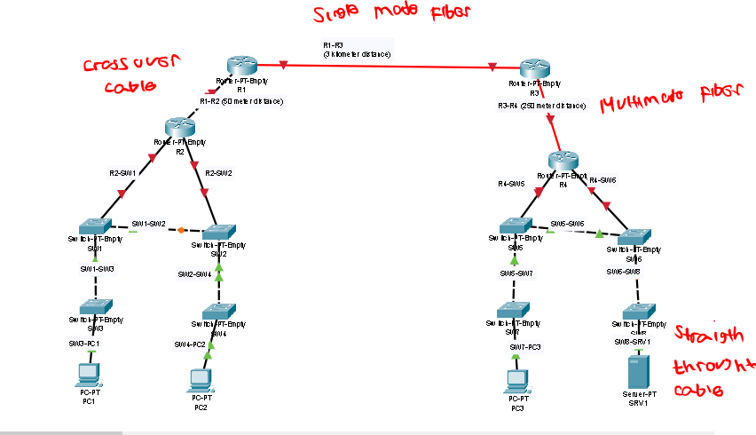

# Lab Practice for CCNA 200-301

## 1. Network Devices

### Cisco Packet Tracer Introduction

#### To Do

- [x] Create network diagram at minutes 16:40 of Day 1 video  

  **Use the following devices:**

  - [x] Cisco 2911 routers (x2)
  - [x] Cisco 2960 switches (x2)
  - [x] Cisco 5505 Firewalls (x2)
  - [x] PCs (x2)
  - [x] Servers (x2)
  - [x] Laptop as the "attacker" in the diagram

> **Tip:** Connect the devices together using Packet Tracer's  
> *"Automatically Choose Connection Type"* function.

!!! example output "Lab day 1"

### 2. Cable, Connectors and Ports

#### To Do

- [x] Connect the network device together according to the table
- [x] Use appropriate type of cable (crossover cable, straight throught cable, single mode fiber or multimode fiber)
!!! note
- [x] Cisco Packet Tracer don't differentiate between single-mode or multimode fiber cable, but think about it which-one is appropriate. Hint: See the length of the device.

!!! example "Lab day 2"

!!! reference "Source Video"
    - [Udemy CCNA Course](https://www.udemy.com/course/ccna-jitl/)
    - [YouTube CCNA Playlist](https://www.youtube.com/playlist?list=PLxbwE86jKRgMpuZuLBivzlM8s2Dk5lXBQ)
