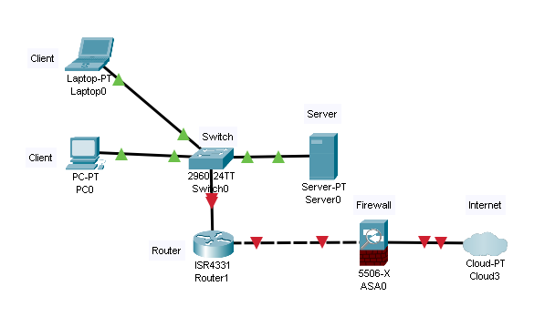
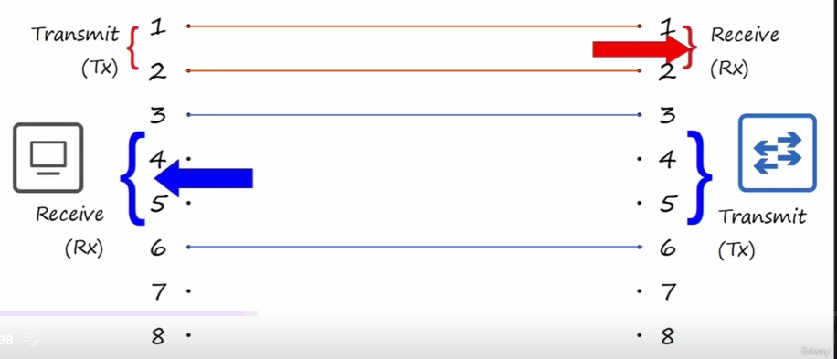
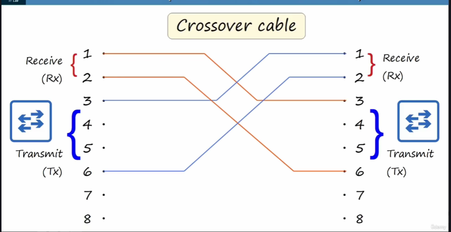
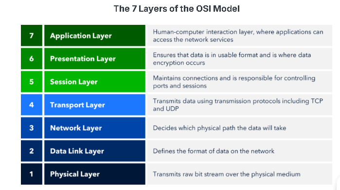
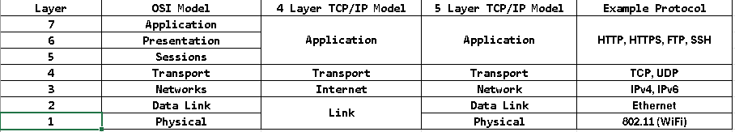

# Introduction to CCNA

## 1. Network

_Network_ (_computer network_) adalah jaringan yang menghubungkan komputer satu sama lain ataupun _device_ lainnya. Atau _computer network_ dapat didefinisikan juga sebagai jaringan komunikasi (_communication network_) yang dapat memungkinkan _node_ untuk saling berbagi _resource_.

!!! info "Node"
    _Node_ adalah segala jenis device yang terkoneksi ke jaringan yang dapat mengirimkan, menerima dan meneruskan data melalui internet. _Node_ dapat berupa PC, atau HP, dan juga infrastruktur jaringan yang dapat menghubungkan perangkat (_routers_, _switch_, _firewall_ dan perangkat yang dapat membentuk jaringan).

!!! info "Resource"
    _Resource_ adalah semua hal yang dapat diakses dan digunakan melalui jaringan. Contohnya, printer yang terkoneksi dalam jaringan dan digunakan bersama oleh pengguna di kantor, dsb.

## 2. Network Devices

### Type of Network Devices

#### Client-Server


Client disini sebagai _device_ yang mengakses / meminta layanan kepada _server_. _Server_ adalah sebuah _device_ yang menyediakan layanan untuk _client_

#### Switch


_Switch_ adalah sebuah perangkat yang dapat menghubungkan beberapa _device_ (PC, Printer, Server, dll) agar dapat berhubungan dan berkomunikasi satu sama lain. Perangkat yang terkoneksi melalui _switch_ dapat berkomunikasi satu sama lain melalui _switch_

!!! Note "Catatan mengenai Switch"
    _Switch_ tidak dapat menyediakan layanan konektivitas antar LAN atau jaringan external, untuk melakukan hal tersebut dibutuhkan _device_ lain.

#### Router


Router adalah sebuah perangkat yang menyediakan layanan agar LAN dapat berkomunikasi dengan jaringan eksternal seperti internet.

!!! Note "Catatan mengenai _Wireless Router_ (_Wi-Fi_ / _home router_)"
    _Wireless Router_ (_Wi-Fi_ / _home router_) adalah perangkat multifungsi yang menggabungkan _router_, _switch_, _wireless access point_, dan _firewall_ dalam satu perangkat.

#### Firewall



_Firewall_ adalah sistem yang berfungsi untuk memantau _traffic_ jaringan yang masuk atau keluar ke perangkat host. Sistem ini kemudian dapat menentukan apakah _traffic_ tersebut diizinkan atau diblokir berdasarkan serangkaian aturan yang telah ditetapkan.

!!! info "LAN"

    **_Local Area Network_ (LAN)** adalah sekumpulan perangkat (_devices_) yang saling terhubung dalam area terbatas,  
    contohnya seperti jaringan di kantor, rumah, kafe, dan lain sebagainya.

!!! info "WAN"

    **_Wide Area Network_** (WAN) adalah sekumpulan jaringan yang saling terhubung satu sama lain dalam area yang luas, contohnya jaringan antar kantor, wilayah, kota atau bahkan negara. 

!!! Note "Cisco Device Keyword"
    - _Catalyst_ -> Cisco Switch (Cisco Catalyst)
    - _Router_ -> Cisco ISR (_Integrated Service Router_)
    - _Security_ -> Cisco ASA (_Adaptive Security Appliance_)
    - _Firepower_ -> Cisco NGFW (_Next Generation Firewall_)

## 3. Cable, Connectors and Ports

### Ethernet

Ethernet adalah kumpulan dari protokol / standart jaringan.

!!! info "RJ-45"

RJ artinya Registered Jack

### Bit and Bytes

- Bit artinya Binary Digits ini adalah sistem angka yang hanya memiliki 2 nilai, yaitu 0 dan 1.

- Byte adalah satuan dari penyimpanan data di dalam komputer. 1 Byte bernilai 8 Bit.

!!! info "Internet Speed"

Kecepatan internet dihitung berdasarkan satuan Bit bukan Byte.

#### Common unit Measuring of Bits

| Names     | Equal to (Base 2) | Equal to (Base 10)                    |
| --------- | ----------------- | ------------------------------------- |
| 1 Kilobit | 1,024 Bit         | 1,000 Bit                             |
| 1 Megabit | 1,024 Kb          | 1,000,000 Bit (1,000 Kilobit)         |
| 1 Gigabit | 1,024 Mb          | 1,000,000,000 Bit (1,000 Megabit)     |
| 1 Terabit | 1,024 Gb          | 1,000,000,000,000 Bit (1,000 Gigabit) |

### Ethernet Standard (IEEE 802.3)

Tabel Ethernet Standard

| Speed    | Common Names     | IEEE Standard | Informal Name | Maximum Lenght Suport |
| -------- | ---------------- | ------------- | ------------- | --------------------- |
| 10 Mbps  | Ethernet         | 802.3i        | 10BASE-T      | 100 m                 |
| 100 Mbps | Fast Ethernet    | 802.3u        | 100BASE-T     | 100 m                 |
| 1 Gbps   | Gigabit Ethernet | 802.3ab       | 1000BASE-T    | 100 m                 |
| 10 Gbps  | 10 Gig Etrhernet | 802.3an       | 10GBASE-T     | 100 m                 |

!!! info "BASE-T"

- BASE artinya Baseband.
- T artinya Twisted.

### UTP (Unshilded Twisted Pair) Cable Ilustration


#### UTP Cable Standard

Tabel Standard Kabel UTP secara umum.

| Speed    | Ethernet Informal  Names | Cable Names |
| -------- | ------------------------ | ----------- |
| 10 Mbps  | 10BASE-T                 | Cat3        |
| 100 Mbps | 100BASE-T                | Cat5        |
| 1 Gbps   | 1000BASE-T               | Cat5e       |
| 10 Gbps  | 10GBASE-T                | Cat6a       |

!!! info "UTP Cable Drawback"

#### UTP Cable (10BASE-T, 100BASE-T)

#### Straight-through and Crossover Cables

- 10BASE-T: Menggunakan dua pasang (4 kabel)
- 100BASE-T: Menggunakan dua pasang (4 kabel)
- 1000BASE-T: Menggunakan empat pasang (8 kabel)
- 10GBASE-T: Menggunakan empat pasang (8 kabel)

#### Straight Throught Pair (STP) Cable



!!! info "Straight Through Cable (STP) Cable"

- Straigth-throught Cable: Ujung kabel disambungkan ke pasangan pin yang sama. Kabel STP biasanya digunakan untuk menghubungkan perangkat jaringan yang berbeda seperti antara PC dengan Router, Router dengan Switch, dsb.

#### Crossover Cable



!!! info "Crossover Cable"

- Crossover: Ujung kabel disambungkan ke pasangan pin yang berlawanan. Kabel crossover biasanya digunakan untuk menghubungan perangkan jaringan yang sama seperti antara PC dengan PC, Router dengan Router, Switch dengan Switch, dsb.

#### Common Device Type and Tx/Rx Pairs

Tabel pasangan Tx/Rx serta tipe Perangkat Jaringan nya

| Device Type | Transmit Pin (Tx) | Recive Pins (Rx) |
| ----------- | ----------------- | ---------------- |
| Router      | 1 and 2           | 3 and 6          |
| Firewall    | 1 and 2           | 3 and 6          |
| PC/Server   | 1 and 2           | 3 and 6          |
| Switch      | 3 and 6           | 1 and 2          |

#### Auto MDI-X

Fitur yang bisa merubah atau menukar posisi Tx/Rx sehingga tidak perlu lagi memusingkan soal kabel straight-through atau crossover cable.

#### UTP Cable (1000BASE-T and 10GBASE-T)


!!! info

- Setiap pasangan pin secara bidirectional artinya setiap pasangan pin dikhusukan untuk satu tugas. Tx atau Rx saja.

### Fiber Cable

Fiber Optic Connections


#### Single Mode and Multimode Fiber Optics Ilustration


#### Fiber Optics Cable Standard

Tabel Standard Kabel Fiber Optic

| Informal Name | IEEE Standard | Speed  | Cable Types               | Maximum Length       |
| ------------- | ------------- | ------ | ------------------------- | -------------------- |
| 1000BASE-X    | 802.3z        | 1 Gbps | Multimode and Single-mode | 550 M (MM) 5 km (SM) |
| 10GBASE-SR    | 802.3ae       | 10Gbps | Multimode                 | 400 m                |
| 10GBASE-LR    | 802.3ae       | 10Gbps | Single-mode               | 10 km                |
| 10GBASE-ER    | 802.3ae       | 10Gbps | Single-mode               | 30 km                |

!!! info "Lain-Lain"

- Full Duplex: Transmit (Tx) dan Recive (Rx) secara bersamaan.
- Half Duplex: Transmit (Tx) dan Recive (Rx) secara bergantian.

### UTP Cable vs Fiber-Optic

Tabel perbandingan kabel UTP dengan Fiber Optic

| UTP Cable                                                                             | Fiber Optics                                                                                                           |
| ------------------------------------------------------------------------------------- | ---------------------------------------------------------------------------------------------------------------------- |
| Harga lebih murah dibandingan fiber optic                                             | Harga lebih mahal dibandingkan kabel UTP                                                                               |
| Jarak jangkauan jauh lebih pendek dibandingkan kabel fiber optic (~100m)              | Jarak jangkauan jauh lebih panjang / luas dibandingkan kabel UTP                                                       |
| Rentan terhadap Electromagnetic Interference (EMI)                                    | Tidak ada kerentanan terhadap Electromagnetic Interference (EMI)                                                       |
| Port RJ-45 digunakan di UTP lebih murah dibandingkan Port SFP                         | Port SFP lebih mahal dibandingakan port RJ-45 (single mode fiber optic lebih mahal dibandingkan multimode fiber optic) |
| memancarkan kebocoran sinyal lemah di luar kabel yang dapat disalin (risiko keamanan) | Tidak memancarkan kebocoran sinyal lemah di luar kabel (tidak ada risiko keamanan)                                     |

## 4. OSI dan TCP/IP Model

### OSI Model

Gambar OSI Model beserta penjelasan masing-masing layer



#### Penjelasan Layer OSI Model

| No  | OSI Layer          | Fungsi / Penjelasan                                                  | Unit Data |
| --- | ------------------ | -------------------------------------------------------------------- | --------- |
| 7   | Application Layer  | Proses aplikasi end-user (browser, email client, dll.)               | Data      |
| 6   | Presentation Layer | Encryption (SSL/TLS), decryption, _compression_ dan formatting media               | Data      |
| 5   | Session Layer      | Start atau stop session (manajemen sesi) dan mengontrol port         | Data      |
| 4   | Transport Layer    | Memilih protokol (TCP/UDP), memecah paket menjadi beberapa bagian, _error handling_    | Segment   |
| 3   | Network Layer      | IP addressing dan routing antar jaringan                             | Packet    |
| 2   | Data Link Layer    | Media Access Control (MAC) addressing                                | Frame     |
| 1   | Physical Layer     | Physical hardware (Fiber optics, RJ45), mentransmisikan sinyal fisik | Bits      |

!!! note "OSI Model Mnemonics"

    ```
    All -> Application layer
    People -> Presentation layer
    Seem -> Session layer
    To -> Transport layer
    Need -> Network layer
    Data -> Data layer
    Processing -> Physical layer
    ```

### Tabel perbedaan OSI Model dan TCP/IP


